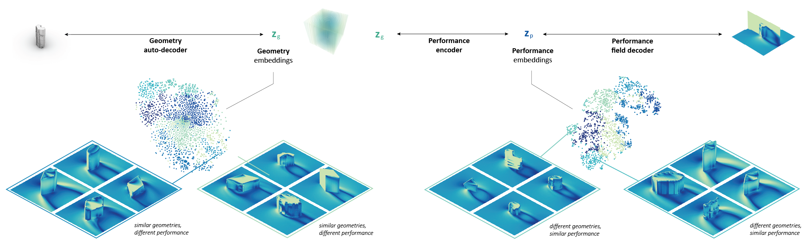
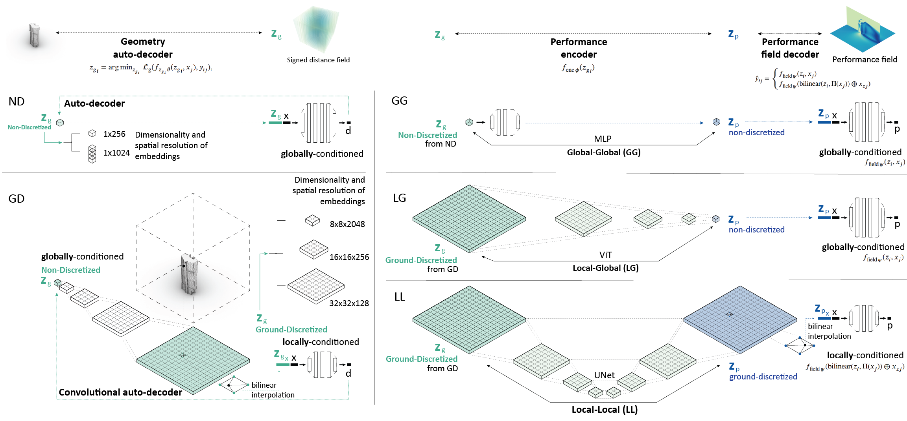
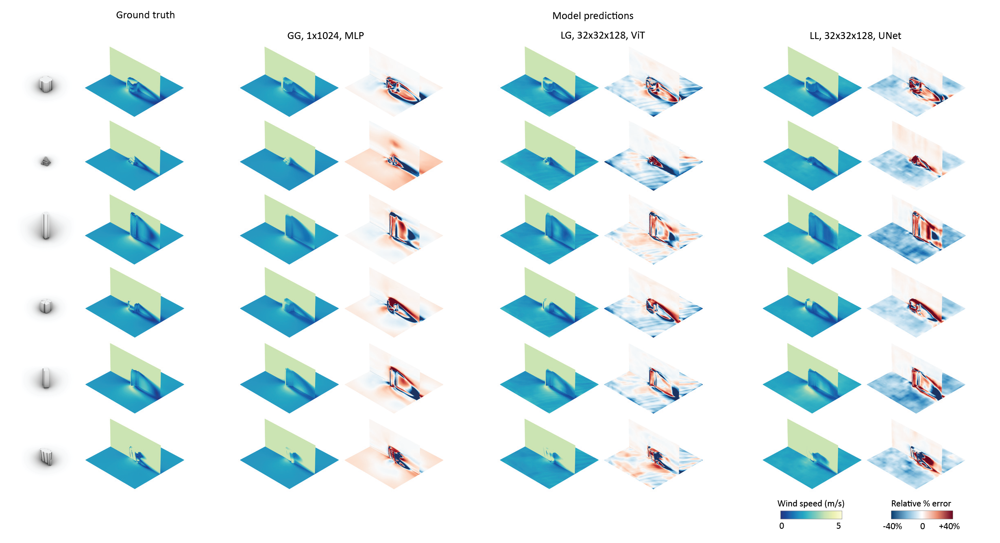

## PerFORM: Implicit Neural Representations for Surrogate Modeling in the Built Environment

<p align="center">

</p>

This repository provides the supporting code for **PerFORM: Implicit Neural Representations for Surrogate Modeling in the Built Environment**, a framework that leverages INRs for the coupled representation and predictive modeling of computationally prohibitive and/or non-differentiable geometric and physical quantities for the built environment.

### Repository Contents

The repository contains the code for models, architectural modules and training utilities needed to train, test, evaluate and visualize the frameworks presented in the paper. It follows the following structure

```
PerFORM/
├── src/
|   |                           # dataset processing and visualization code
│   ├── learning/               # models, modules, training utils
│   └── scripts/                
│     ├── geo/                  # scripts for geometry models
|     └── perf/                 # scripts for performance models
├── requirements.txt
├── LICENSE.md
└── README.md
```

- All **our code** lives under `src/`

### Framework Description

PerFORM is an INR-based surrogate modeling framework for full flow field prediction in the built environment, with broader applicability to complex geometries. 

<p align="center">

</p>

It adapts INRs to surrogate modeling in a domain characterized by large physical extent, fine-scale features, and high topological complexity, and demonstrated on the inference of wind flow fields around buildings. 

<p align="center">

</p>

Beyond enabling the integration and acceleration of physics field inference for building applications, Per-FORM demonstrates that the structure of the learned performance latent space can directly support performance-informed design tasks, through design applications such as performance-based categorization of building morphologies and performance-informed design ideation, illustrating new pathways for embedding performance feedback into computer-aided design processes and accelerating performance-informed design workflows.

<p align="center">

</p>

### Citation

When building on this research or using this code, please cite using the following:

```
@article{mokhtarImplicitNeuralRepresentations2025,
  title = {Implicit Neural Representations for Surrogate Modeling in the Built Environment},
  author = {Mokhtar, Sarah and Mueller, Caitlin},
  date = {2025},
  journaltitle = {...},
  shortjournal = {...}
}
```


